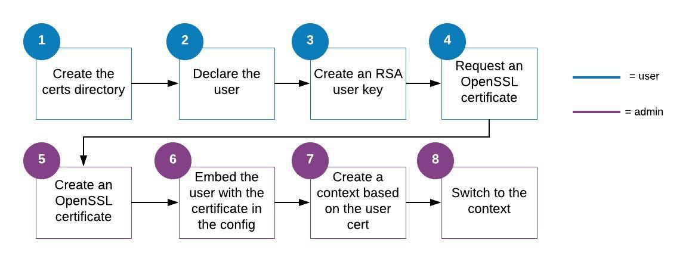

# Kubernetes and Transport Layer Security

## Keys, Users and Groups


## Certificate Management Process in the Enterprise



**Note** This lab is intended to be run under [`minikube`](https://kubernetes.io/docs/setup/minikube/). You can use Katacoda's `minikube` scenario to run this lab. 
You'll find the Katacoda `minikube` environment here: https://katacoda.com/courses/kubernetes/launch-single-node-cluster

## Securing a Kubernetes Ingress Using TLS

We're going to implement TLS on minikube with the ingress controller enabled.

**Step 1:** Enable the ingress controller on minikube

`minikube addons enable ingress`

**Step 2:** Create an `nginx` deployment

`kubectl run nginx --image=nginx`

**Step 3:** Bind the service:

`kubectl expose deployment nginx --port 80`

**Step 4:** Create the unsecured ingress

`kubectl apply -f ingress.yaml`

Create an entry into the file `/etc/hosts` so that `example.com` when called on the local machine will
resolve to the IP address of minikube.

**Step 5:** Execute the following command to make the entry to `/etc/hosts`.

`echo "$(minikube ip) example.com" | sudo tee -a /etc/hosts`

**Step 6:** Make a call using `curl` to ensure the service is running

`curl http://example.com`

**Step 7:** Now it's time to make the self signed TLS certificate. Execute the following command:

`openssl req -x509 -newkey rsa:4096 -sha256 -nodes -keyout tls.key -out tls.crt -subj "/CN=example.com" -days 365`

**WHERE**

`-keyout tls.key` is the name of the private key

`-out tls.crt` is the name of the public certificate passed in by a calling client requesting access

`-subj "/CN=example.com"` indicates the credentials apply to the domain, `example.com`

`-days 365` sets the credentials to be valid for 365 days

**Step 8:** Create the Kubernetes secret that will hold the private key and public certificate. We'll do
this imperatively. So execute the following command.

`kubectl create secret tls example-com-tls --cert=tls.crt --key=tls.key`

**Step 9:**: Update the ingress to include the certificate information and binding to `example.com`.

`kubectl apply -f update-ingress.yaml`

**Step 10:**: Try to access the nginx server using `curl` as you did before. You'll fail.

`curl http://example.com`

**Step 11:**: Make a `curl` call with the certificate.

`curl --cacert tls.crt https://example.com`

## Clean Up

Delete the deployment

`kubectl delete deployment nginx`

Delete the service

`kubectl delete service nginx`

Delete ingress

`kubectl delete ingress nginx`

Delete the secret

`kubectl delete secret example-com-tls`

## Manifests

ingress.yaml:

```yaml
apiVersion: extensions/v1beta1
kind: Ingress
metadata:
  name: nginx
spec:
  rules:
    - host: example.com
      http:
        paths:
        - path: /
          backend:
            serviceName: nginx
```

update-ingress.yaml
```yaml
apiVersion: extensions/v1beta1
kind: Ingress
metadata:
  name: nginx
spec:
  tls:
    - secretName: example-com-tls
      hosts:
        - example.com
  rules:
    - host: example.com
      http:
        paths:
        - path: /
          backend:
            serviceName: nginx
            servicePort: 80

```


