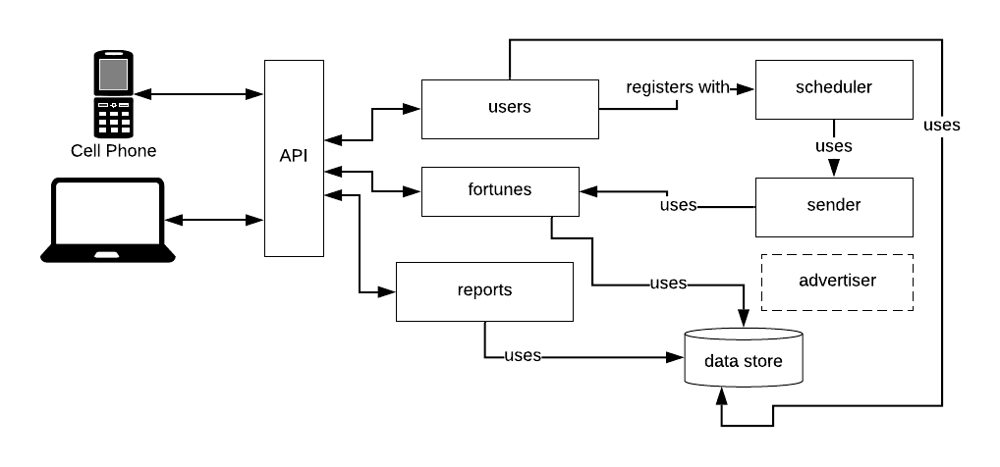

# Microservice Architecture Definition Worksheet

**The original scencario description***

A marketing company wants your group to design an application that will deliver a “fortune cookie” to willing recipients. All that’s required is that the user register with the app using either Facebook, Google or LinkedIn credentials. Or the user can custom register by providing standard profile information. The fortune cookie text is provided by the WiseSayings service. Each fortune cookie is accompanied by an advertisement from “Ad Auction” service. However, users need to be provided with with the option to not receive advertisements. Also, a feature needs to be implemented supporting a Fortune Cookie presence on Twitter by sending Fortune Cookie tweets out at configurable intervals. Fortune Cookie needs to work on iPhone, Android, standard web pages, Alexa and SMS. In addition, Fortune Cookie needs to provide usage and performance metrics on demand to administrative personnel. Fortune cookie is a free application.

**The original monolithic design***

The goal of the exercise is to design and describe your microservice to the level of detail that the work can be assigned to a third party contractor for implementation.

Your design should be “language and framework agnostic”. As such your team needs to address
the essentials of the microservices design that need to be understood and implemented
with little or no regard to specifc implementation technology.

The following questions are intended to help bring clarity to your design efforts and detail to your specification.

1. What is the semantic definition of your microservice? In order words, what is the concern of the service? At a logical level,
what is it supposed to do?

2. Is your microservice intended to be synchronous, asynchronous, or both?

3. How will the microservice be exposed to consumers of the service?

4. What is the structure/format of the data the microservice will consume?

5. What is the structure/format of the data the microservice will emit?

6. How will the microservice be secured?

7. What are the operational boundaries of the microservice in terms of latency? 

8. What are the operational boundaries in terms of resource consumption? 

9. To what degree do you guarantee the accuracy of your data?

10. What is the scope of monitoring the service needs to support?
